# Circular Dependencies Detector

## Presentation:

### Demo Video : https://youtu.be/8ZBd1RLFG3M

**Marketplace link :** https://www.unrealengine.com/marketplace/en-US/slug/circular-dependencies-detector

With the Circular Dependencies Detector plugin, you can quickly detect in your project all circular dependencies, dependencies in both ways. The detection is done in compile and save time. You can place the Editor Widget wherever you want.

Send by mail any suggestion for the plugin. It will always be considered.  
Please report any unexpected behaviours. It will be fixed as soon as possible.

**Support e-mail :** bstt.ue4@gmail.com

## Sources

You can get the latest version of the plugin on this [link](https://github.com/bstt/CircularDependenciesDetector/tree/release).

You can freely **get the plugin via the UE4 marketplace** in order to automatically get the updates.

## Documentation:

### Table of contents

#### 1. [Use Circular Dependencies Detector](#1-Use-Circular-Dependencies-Detector-1)
##### 1.1. [Run the Editor Widget](#11-Run-the-Editor-Widget-1)
##### 1.2. [Display](#12-Display-1)
##### 1.3. [Refresh button](#13-Refresh-button-1)
##### 1.4. [Open asset](#14-Open-asset-1)

#### 2. [Solve circular dependencies](#2-Solve-circular-dependencies-1)
##### 2.1. [Use interfaces](#21-Use-interfaces-1)
##### 2.2. [Use Event Dispatcher](#22-Use-Event-Dispatcher-1)
##### 2.3. [Redo the design](#23-Redo-the-design-1)

### 1. Use Circular Dependencies Detector

Circular Dependencies Detector is a tool that **only detect** all circular dependencies in a project. You need to **manually solve these circular dependencies**. Some ways to fix them are explained in the section : [Solve circular dependencies](#2-Solve-circular-dependencies-1).

#### 1.1. Run the Editor Widget

For the first opening you need to :
- In Content Browser, enable **Show Plugin Content**,
- Enable **Show Engine Content** (It is recommanded to ***disable Show C++ Classes***)
- Go to the **Circular Dependencies Detector plugin folder,**
- **Right click** on the CircularDependencies\_EWBP (**do not double-click**),
- Select **Run Editor Utility Widget**.

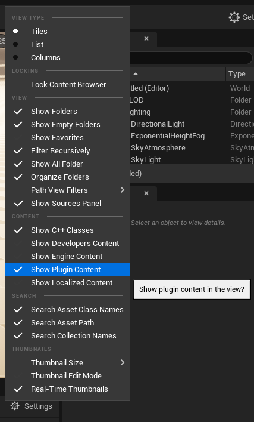
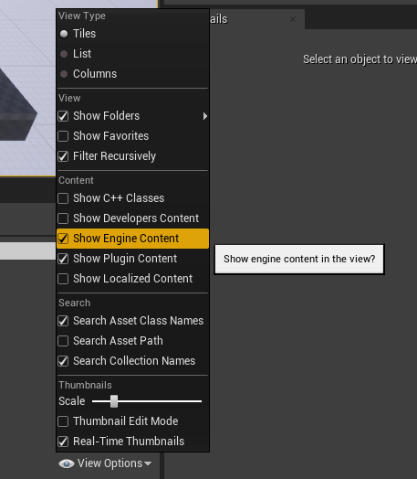

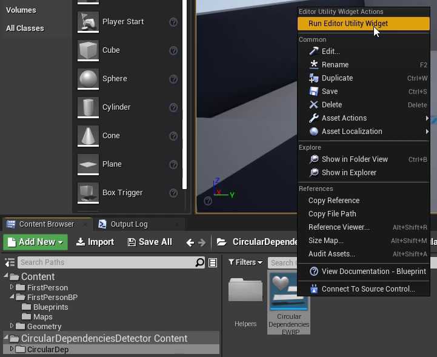

If you opened and closed the EWBP, you can re-open it by going to the **Edit Menu -> Editor Widget -> Run EWBP**.

[Table of contents](#Table-of-contents)

#### 1.2. Display

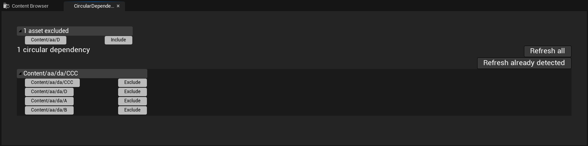

Displayed by the plugin :
- number of circular dependencies
- all assets involved in circular dependencies grouped by block.

The current display means this :

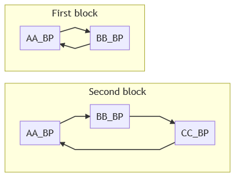

*(A -> B means A depends on B)*

If an asset is displayed in 2 blocks it means that it is involved in 2 different circular dependencies.

[Table of contents](#Table-of-contents)

#### 1.3. Refresh button

On **compile and save**, UE4 compute the dependencies. Sometimes it is not immediately computed. After a short amount of time (30 seconds maximum), you can press the button refresh to check if the dependencies are still present. Sometimes it is badly computed especially when dependencies were contained in a node group. Close and open again the blueprint to fix the computation of dependencies.

You can check the current dependencies by opening the Reference viewer (Right click on the asset -> Reference viewer).

The plugin is using **only hard referencies**.

[Table of contents](#Table-of-contents)

#### 1.4. Open asset

Press the button of a displayed asset in order to open it. You must **manually search and remove** the references of the asset you no longer have to depend on.

[Table of contents](#Table-of-contents)

### 2. Solve circular dependencies

In UE4, it is really simple to generate circular dependencies with Blueprint since all blueprints are in the same scope.
In C++, you must use forward declaration to have circular dependencies, it means that if you have ones, it's intentional.

[Circular dependencies](https://en.wikipedia.org/wiki/Circular_dependency) are considered as an anti-pattern because of their negative effects : tight coupling, memory leaks...  
They can be avoid by using [desing patterns](https://refactoring.guru/design-patterns/catalog).

**Problem :**  
You have 2 classes A and B, **you are forced to make B depends on A** and your class A call some functions funcB1 and funcB2 from class B (and then A depends on B).

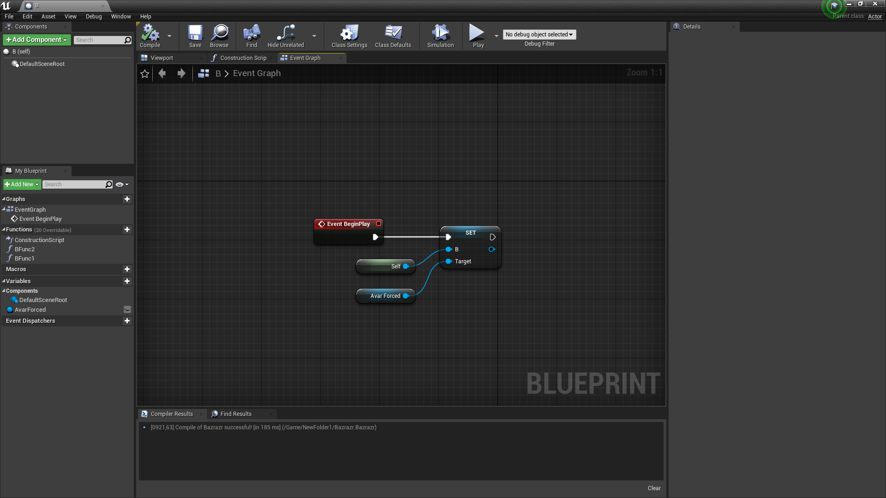
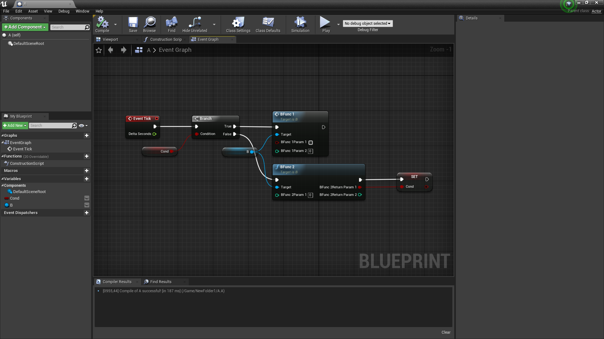

**Current dependencies :**  

*(A -> B means A depends on B)*

[Table of contents](#Table-of-contents)

#### 2.1. Use interfaces

[Dependency injection pattern](https://en.wikipedia.org/wiki/Dependency_injection) is a simple way to resolve dependencies problem.

**Solution :**  
Move the functions funcB1 and funcB2 in an interface B\_Interface and call the functions from the interface instead of the class B.

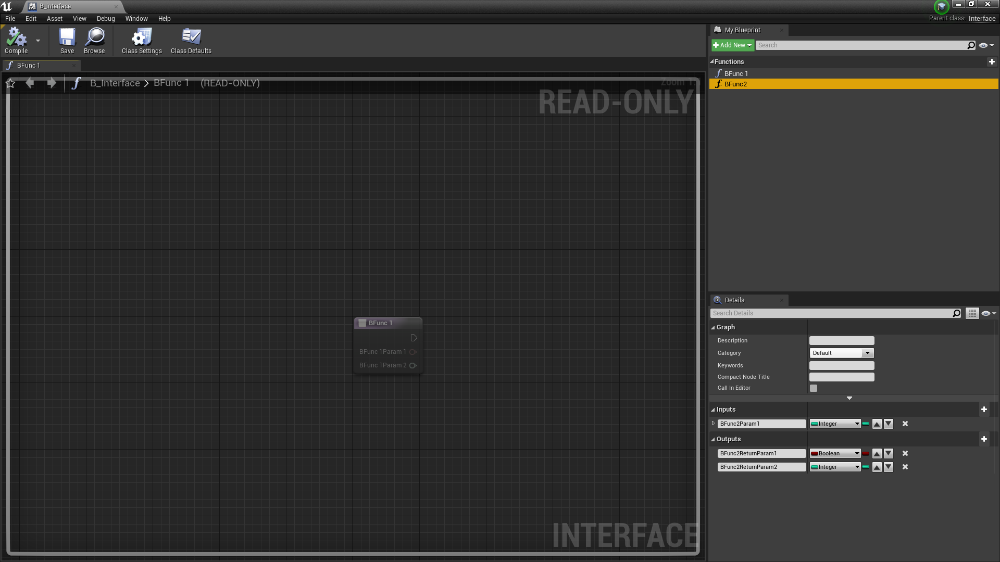

**New dependencies :**  

**Warning :** You must not directely put a reference of class B or any type that depends on class B. You'll need to put a reference of type B\_interface or of a type that depends on B\_interface.

[Table of contents](#Table-of-contents)

#### 2.2. Use Event Dispatcher

[Observer design pattern](https://refactoring.guru/design-patterns/observer) is another simple way to resolve dependencies problem.

**Solution :**  
Declare 2 events dispatcher within the class A, one of type funcB1, one of type funcB2, subscribe the class B to these dispatcher and call the dispatcher in your class A.

If you need a return value for your 2 functions, you need to create 2 other functions return\_funcB1, return\_funcB2 within the class A and call them in class B instead of returning values.

**New dependencies :**  
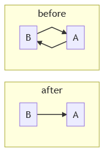

You can even put the object of class A as parameter in order to get the caller (especially needed if there are several callers).

If you have several behaviours after a return value, you can use an enum parameter in order to switch to the behaviour you want to get.

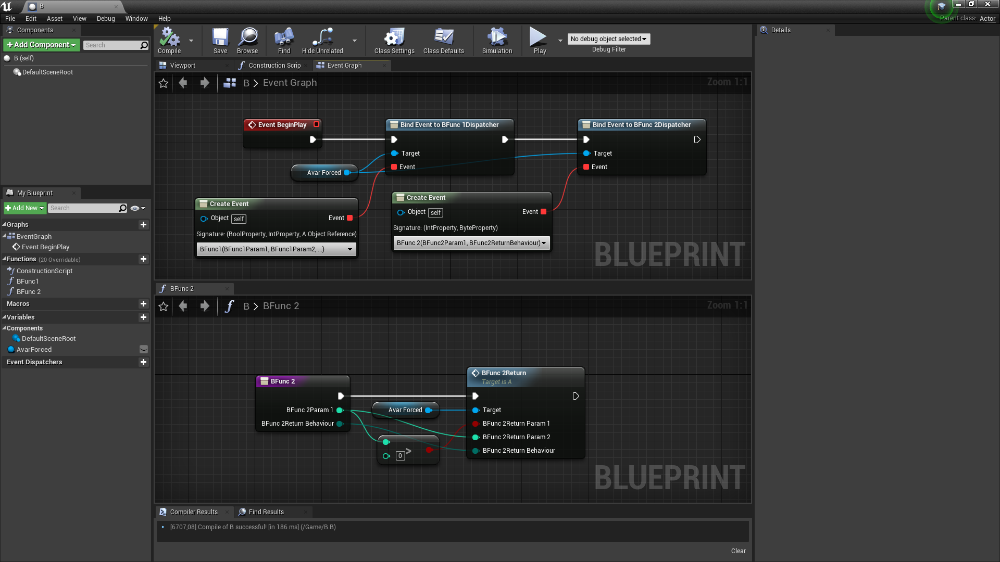
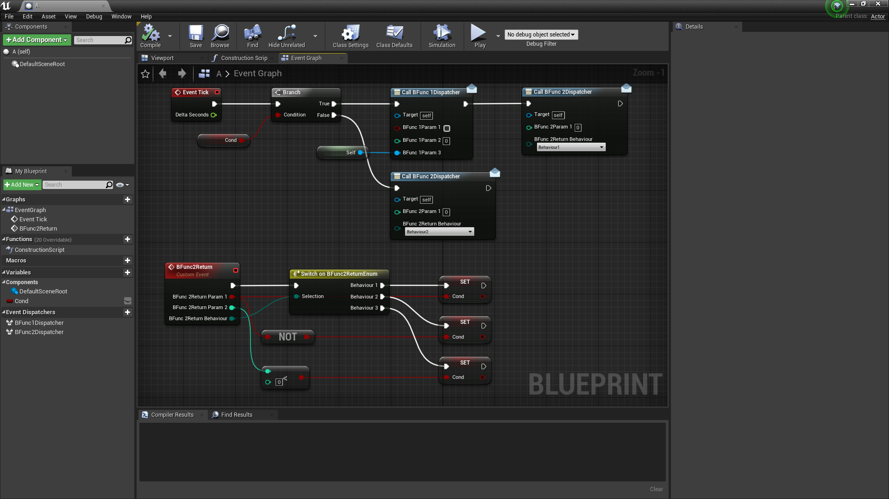

**Warning :** You can't put a reference of class B or any type that depends on class B.

[Table of contents](#Table-of-contents)

#### 2.3. Redo the design

If you have circular dependencies, it is certainly a design problem.
This method is the hardest way to solve this but it is also the best.

There is no specific rule or magic trick to solve it : you'll need to use your brain to fix it.

But here are some tips that can help you to make a good design.
Generally all design problem come from a bad data structure, and not from a bad implementation.

You need to wonder :
- Do I really need this ? (Can I get this from another way ?)
- How will I use this ? (Is it displayed ? used for computation ? Is it a storage of a computation ?)
- Do I really need this here ? (Who owns who ?)

It is pretty hard to objectively answer to these questions but it is necessary to improve your data structures.

When you reach the point that you can't improve your data structures anymore, you need to wonder :
- Which object must call this function ? (who interacts with who ?)

[Table of contents](#Table-of-contents)
