# Circular Dependencies Detector

## Presentation:

### Demo Video : https://youtu.be/8ZBd1RLFG3M

**Marketplace link :** https://www.unrealengine.com/marketplace/en-US/slug/circular-dependencies-detector

With the Circular Dependencies Detector plugin, you can quickly detect in your project all circular dependencies, dependencies in both ways. The detection is done in compile and save time. You can place the Editor Widget wherever you want.

Send by mail any suggestion for the plugin. It will always be considered.  
Please report any unexpected behaviours. It will be fixed as soon as possible.

**Support e-mail :** bstt.ue4@gmail.com

## Sources

You can get the lastest source code of the plugin on this [link](https://github.com/bstt/CircularDependenciesDetector/tree/sources).

You can freely **get the plugin via the Unreal Engine marketplace** in order to automatically get the updates.

## Documentation:

### Table of contents

#### 1. [Use Circular Dependencies Detector](#1-Use-Circular-Dependencies-Detector-1)

##### 1.1. [Run the Editor Widget](#11-Run-the-Editor-Widget-1)

##### 1.2. [Display](#12-Display-1)

##### 1.3. [Refresh all button](#13-Refresh-all-button-1)

##### 1.4. [Refresh already detected button](#14-Refresh-already-detected-button-1)

##### 1.5. [Open asset](#15-Open-asset-1)

##### 1.6. [Exclude button](#16-Exclude-button-1)

#### 2. [Configuration](#2-Configuration-1)

##### 2.1. [Show On Startup](#21-Show-On-Startup-1)

##### 2.2. [Max Detection Count](#22-Max-Detection-Count-1)

##### 2.3. [Automatic Refresh Delay](#23-Automatic-Refresh-Delay-1)

#### 3. [Solve circular dependencies](#3-Solve-circular-dependencies-1)

##### 3.1. [Use interfaces](#31-Use-interfaces-1)

##### 3.2. [Use Event Dispatcher](#32-Use-Event-Dispatcher-1)

##### 3.3. [Split Blueprint Function Library](#33-Split-Blueprint-Function-Library-1)

##### 3.4. [Redo the design](#34-Redo-the-design-1)

#### 4. [Contact me](#4-Contact-me-1)

### 1. Use Circular Dependencies Detector

Circular Dependencies Detector is a tool that **only detect** all circular dependencies in a project. You need to **manually solve these circular dependencies**. Some ways to fix them are explained in the section : [Solve circular dependencies](#3-Solve-circular-dependencies-1).

#### 1.1. Run the Editor Widget

Show steps in case of Editor Widget not automatically opened

- In Content Browser, enable **Show Plugin Content**,
- Enable **Show Engine Content** (It is recommanded to **_disable Show C++ Classes_**)
- Go to the **Circular Dependencies Detector plugin folder,**
- **Right click** on the CircularDependencies_EWBP (**do not double-click**),
- Select **Run Editor Utility Widget**.

If you opened and closed the EWBP, you can re-open it by going to the **Edit Menu -> Editor Widget -> Run EWBP**.

[Table of contents](#Table-of-contents)

#### 1.2. Display

Displayed by the plugin :

- number of excluded assets
- all excluded assets
- number of circular dependencies
- all assets involved in circular dependencies grouped by block.

The current display means this :

_(A -> B means A depends on B)_

If an asset is displayed in 2 blocks it means that it is involved in 2 different circular dependencies.

All diplayed circular dependencies don't contain the excluded assets.

[Table of contents](#Table-of-contents)

#### 1.3. Refresh all button

This button start the detection of circular dependencies on all files.

On **compile and save**, Unreal Engine compute the dependencies. Sometimes it is not immediately computed. After a short amount of time (30 seconds maximum), you can press the button refresh to check if the dependencies are still present. Sometimes it is wrongly computed especially when dependencies were contained in a node group. Close and open again the blueprint to fix the computation of dependencies.

You can check the current dependencies by opening the Reference viewer (Right click on the asset -> Reference viewer).

The plugin is using **only hard referencies**.

[Table of contents](#Table-of-contents)

#### 1.4. Refresh already detected button

This button only refresh the circular dependencies already detected.

By default the automatic refresh is only done on the files involved in circular dependencies already detected. If there is none, this is done on all files.

#### 1.5. Open asset

Press the button of a displayed asset in order to open it. The next asset in the circular dependency is **automatically search**. You just need **to manually make the search result empty** in order to break the circular dependency.

**A specific search is done for Blueprint Function Library.**

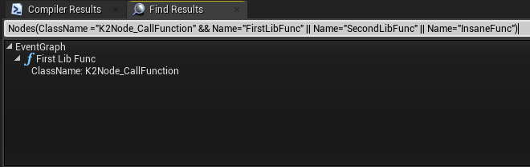

[Table of contents](#Table-of-contents)

#### 1.6. Exclude button

For each asset involved in a circular dependencies, you can press the **Exclude button** in order to exclude the asset from the search of all circular dependencies.  
For each excluded asset, you can press the **Include button** in order to include the asset in the search of all circular dependencies.

[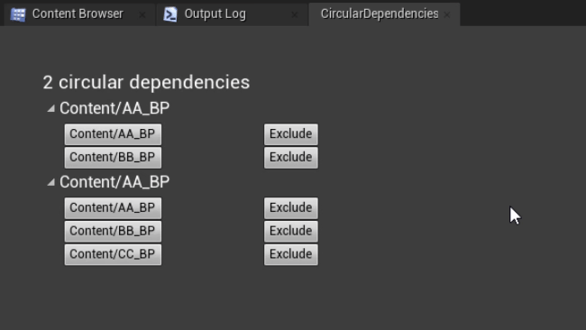](Documentation/Gifs/1_61-ExcludeAsset.gif)

[Table of contents](#Table-of-contents)

### 2. Configuration

You can change CDD option in ***Editor Preferences/Plugins/Circular Dependencies Detector.***

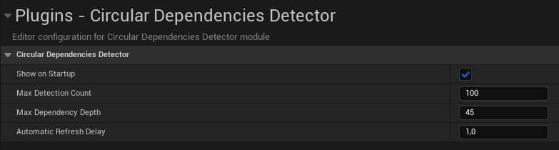

#### 2.1. Show On Startup

Enable this option to spawn the CDD Editor Widget on startup.

#### 2.2. Max Detection Count

This is the number of circular dependencies detected from which detection is interrupted.

#### 2.3. Automatic Refresh Delay

This is the delay in seconds before an automatic refresh, put a negative value to disable the automatic refresh.

### 3. Solve circular dependencies

In Unreal Engine, it is really simple to generate circular dependencies with Blueprint since all blueprints are in the same scope.
In C++, you must use forward declaration to have circular dependencies, it means that if you have ones, it's intentional.

[Circular dependencies](https://en.wikipedia.org/wiki/Circular_dependency) are considered as an anti-pattern because of their negative effects : tight coupling, memory leaks...  
They can be avoid by using [desing patterns](https://refactoring.guru/design-patterns/catalog).

**Problem :**  
You have 2 classes A and B, **you are forced to make B depends on A** and your class A call some functions funcB1 and funcB2 from class B (and then A depends on B).

**Current dependencies :**  
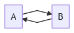

_(A -> B means A depends on B)_

[Table of contents](#Table-of-contents)

#### 3.1. Use interfaces

[Dependency injection pattern](https://en.wikipedia.org/wiki/Dependency_injection) is a simple way to resolve dependencies problem.

**Solution :**  
Move the functions funcB1 and funcB2 in an interface B_Interface and call the functions from the interface instead of the class B.

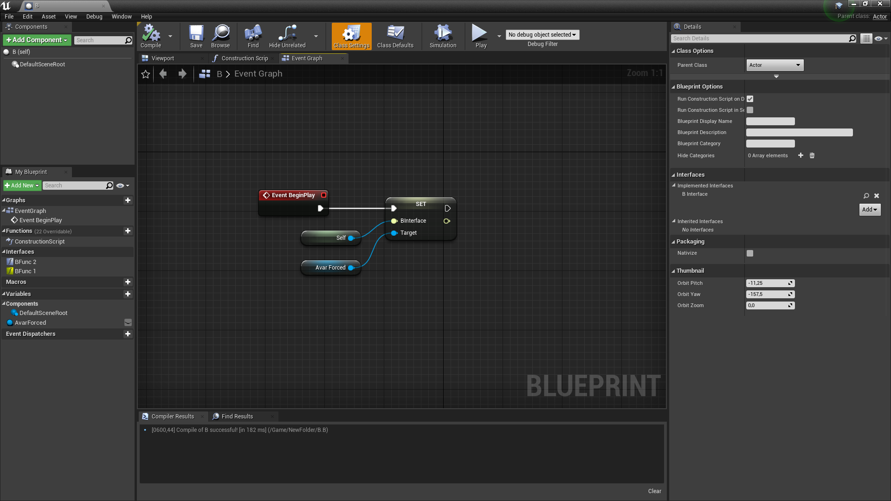
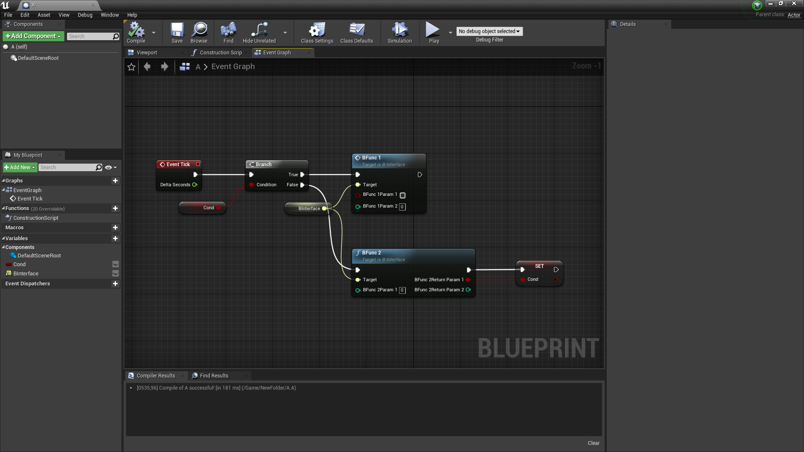

**New dependencies :**  
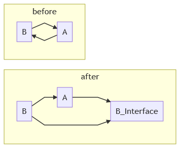

**Warning :** You must not directely put a reference of class B or any type that depends on class B. You'll need to put a reference of type B_interface or of a type that depends on B_interface.

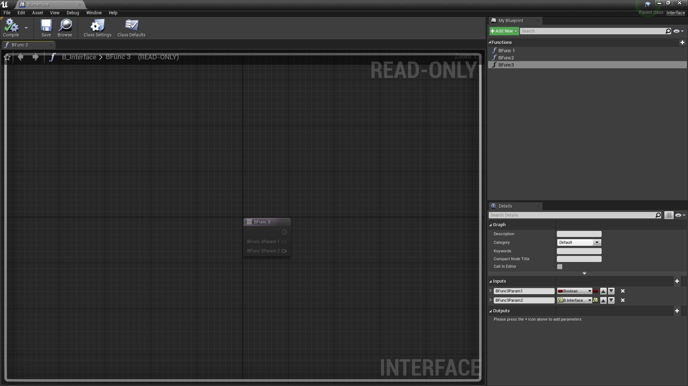
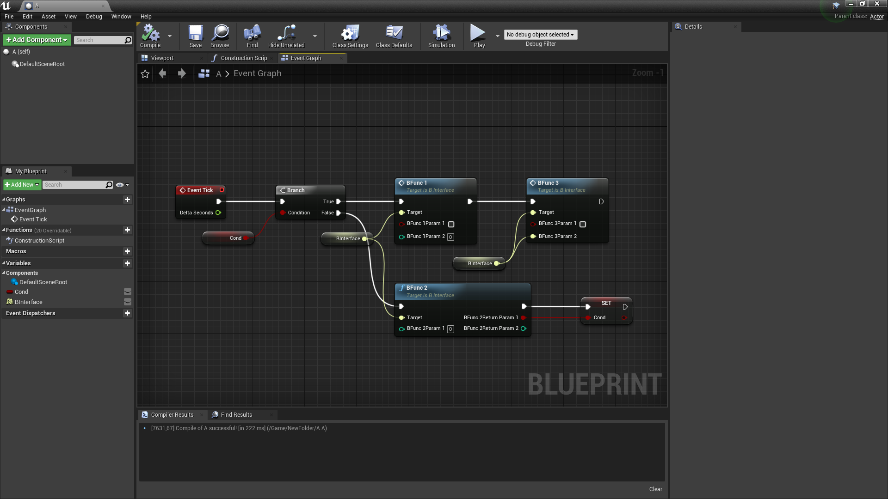

[Table of contents](#Table-of-contents)

#### 3.2. Use Event Dispatcher

[Observer design pattern](https://refactoring.guru/design-patterns/observer) is another simple way to resolve dependencies problem.

**Solution :**  
Declare 2 events dispatcher within the class A, one of type funcB1, one of type funcB2, subscribe the class B to these dispatcher and call the dispatcher in your class A.

If you need a return value for your 2 functions, you need to create 2 other functions return_funcB1, return_funcB2 within the class A and call them in class B instead of returning values.

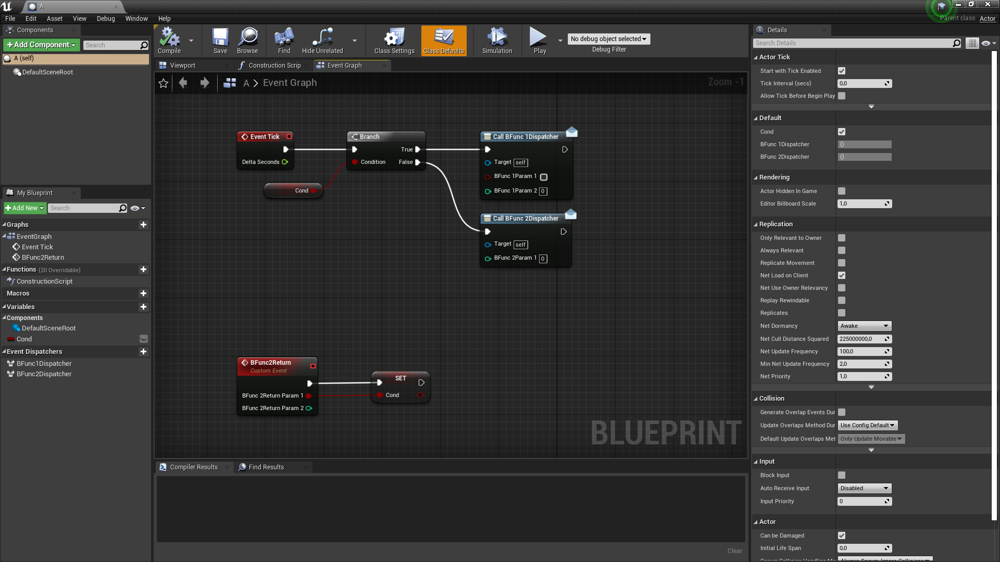
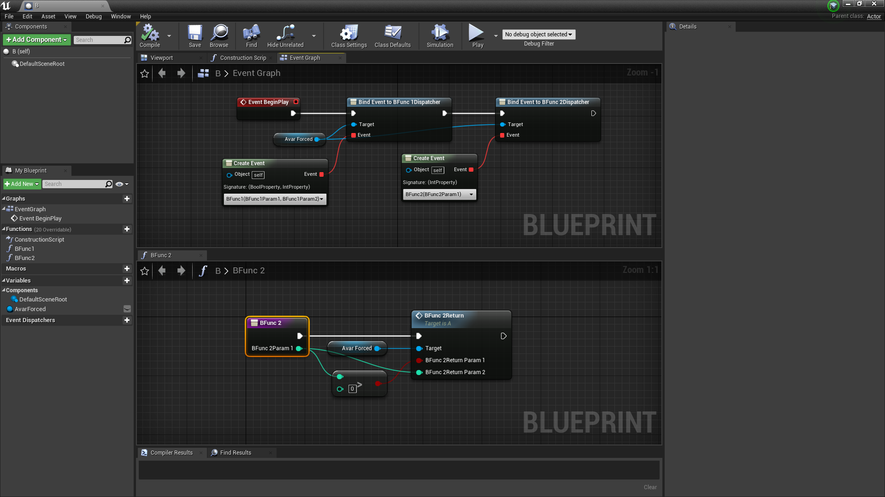

**New dependencies :**  

You can even put the object of class A as parameter in order to get the caller (especially needed if there are several callers).

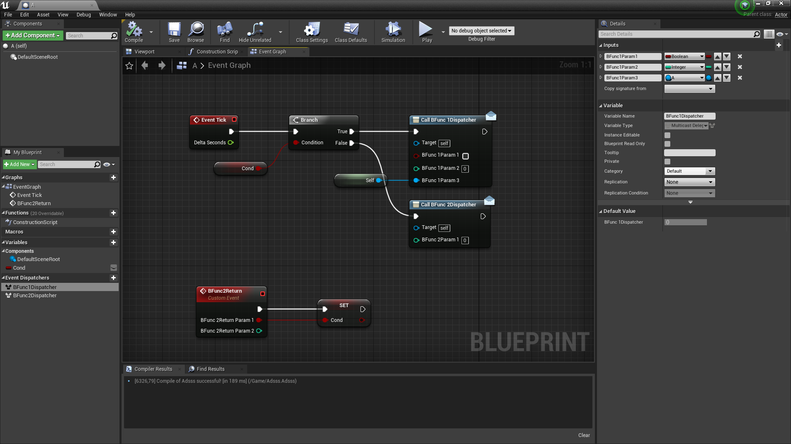

If you have several behaviours after a return value, you can use an enum parameter in order to switch to the behaviour you want to get.

**Warning :** You can't put a reference of class B or any type that depends on class B.

[Table of contents](#Table-of-contents)

#### 3.3. Split Blueprint Function Library

**Problem :** _(explained with a schema to improve clarity)_

- **MyBlueprint** is a class.
- **MyLib** is a Blueprint Function Library.
- **FuncOfMyBP** is a function of MyLib that depends on MyBlueprint.
- **FuncNotOfMyBP** is a function of MyLib that does **NOT** depend on MyBlueprint.
- MyBlueprint use the function FuncNotOfMyBP.
- MyBlueprint do **NOT** use the function FuncOfMyBP.

_By the way, a function of MyLib that depends on MyBlueprint and that is used by MyBlueprint uses should be inside of MyBlueprint (cf. [Redo the design](#34-Redo-the-design-1))._  
_If you can't move the function inside MyBlueprint, you can still [use interfaces](#31-Use-interfaces-1)._

**Solution :**  
Place the function **FuncNotOfMyBP** in another Blueprint Function Library MyOtherLib.

**New dependencies :**  

**Note :** All functions that depends on MyBlueprint must be in a library that is **NOT** used by MyBlueprint or inside MyBlueprint.

[Table of contents](#Table-of-contents)

#### 3.4. Redo the design

If you have circular dependencies, it is certainly a design problem.
This method is the hardest way to solve this but it is also the best.

There is no specific rule or magic trick to solve it : you'll need to use your brain to fix it.

But here are some tips that can help you to make a good design.
Generally all design problem come from a bad data structure, and not from a bad implementation.

You need to wonder :

- Do I really need this ? (Can I get this from another way ?)
- How will I use this ? (Is it displayed ? used for computation ? Is it a storage of a computation ?)
- Do I really need this here ? (Who owns who ?)

It is pretty hard to objectively answer to these questions but it is necessary to improve your data structures.

When you reach the point that you can't improve your data structures anymore, you need to wonder :

- Which object must call this function ? (who interacts with who ?)

[Table of contents](#Table-of-contents)

### 4. Contact me

When you got an error or a crash :

- Save your project.
- Try to reproduce the error.
- Fill this [template e-mail](Template_e_mail.md)
- Send it at this e-mail address : bstt.ue4@gmail.com

Until a valid fix is found, try right-click on content browser and then **Fix up Redirectors in Folder**.  
Please **send the project before** trying this.

[Table of contents](#Table-of-contents)
